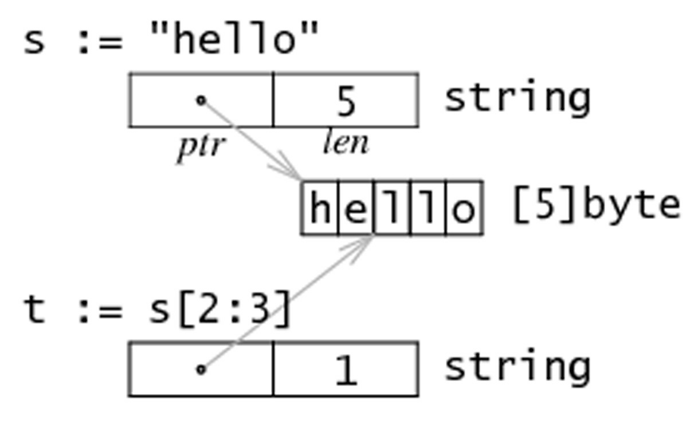

# 7.6 字串、陣列和切片的應用

## 7.6.1 從字串生成位元組切片

假設 s 是一個字串（本質上是一個位元組陣列），那麼就可以直接通過 `c := []byte(s)` 來獲取一個位元組的切片 c。另外，您還可以通過 copy 函式來達到相同的目的：`copy(dst []byte, src string)`。

同樣的，還可以使用 for-range 來獲得每個元素（Listing 7.13—for_string.go）：

```go
package main

import "fmt"

func main() {
    s := "\u00ff\u754c"
    for i, c := range s {
        fmt.Printf("%d:%c ", i, c)
    }
}
```

輸出：

    0:ÿ 2:界

我們知道，Unicode 字元會佔用 2 個位元組，有些甚至需要 3 個或者 4 個位元組來進行表示。如果發現錯誤的 UTF8 字元，則該字元會被設定為 U+FFFD 並且索引向前移動一個位元組。和字串轉換一樣，您同樣可以使用 `c := []int32(s)` 語法，這樣切片中的每個 int 都會包含對應的 Unicode 程式碼，因為字串中的每次字元都會對應一個整數。類似的，您也可以將字串轉換為元素型別為 rune 的切片：`r := []rune(s)`。

可以通過程式碼 `len([]int32(s))` 來獲得字串中字元的數量，但使用 `utf8.RuneCountInString(s)` 效率會更高一點。(參考[count_characters.go](exercises/chapter_4/count_characters.go))

您還可以將一個字串追加到某一個位元組切片的尾部：

```go
var b []byte
var s string
b = append(b, s...)
```

## 7.6.2 獲取字串的某一部分

使用 `substr := str[start:end]` 可以從字串 str 獲取到從索引 start 開始到 `end-1` 位置的子字串。同樣的，`str[start:]` 則表示獲取從 start 開始到 `len(str)-1` 位置的子字串。而 `str[:end]` 表示獲取從 0 開始到 `end-1` 的子字串。

## 7.6.3 字串和切片的記憶體結構

在記憶體中，一個字串實際上是一個雙字結構，即一個指向實際資料的指標和記錄字串長度的整數（見圖 7.4）。因為指標對使用者來説是完全不可見，因此我們可以依舊把字串看做是一個值型別，也就是一個字元陣列。

字串 `string s = "hello"` 和子字串 `t = s[2:3]` 在記憶體中的結構可以用下圖表示：



## 7.6.4 修改字串中的某個字元

Go 語言中的字串是不可變的，也就是説 `str[index]` 這樣的表示式是不可以被放在等號左側的。如果嘗試執行 `str[i] = 'D'` 會得到錯誤：`cannot assign to str[i]`。

因此，您必須先將字串轉換成位元組陣列，然後再通過修改陣列中的元素值來達到修改字串的目的，最後將位元組陣列轉換回字串格式。

例如，將字串 "hello" 轉換為 "cello"：

```go
s := "hello"
c := []byte(s)
c[0] = 'c'
s2 := string(c) // s2 == "cello"
```

所以，您可以通過操作切片來完成對字串的操作。

## 7.6.5 位元組陣列對比函式

下面的 `Compare` 函式會返回兩個位元組陣列字典順序的整數對比結果，即 `0 if a == b, -1 if a < b, 1 if a > b`。

```go
func Compare(a, b[]byte) int {
    for i:=0; i < len(a) && i < len(b); i++ {
        switch {
        case a[i] > b[i]:
            return 1
        case a[i] < b[i]:
            return -1
        }
    }
    // 陣列的長度可能不同
    switch {
    case len(a) < len(b):
        return -1
    case len(a) > len(b):
        return 1
    }
    return 0 // 陣列相等
}
```

## 7.6.6 搜尋及排序切片和陣列

標準庫提供了 `sort` 包來實現常見的搜尋和排序操作。您可以使用 `sort` 包中的函式 `func Ints(a []int)` 來實現對 int 型別的切片排序。例如 `sort.Ints(arri)`，其中變數 arri 就是需要被升序排序的陣列或切片。為了檢查某個陣列是否已經被排序，可以通過函式 `IntsAreSorted(a []int) bool` 來檢查，如果返回 true 則表示已經被排序。

類似的，可以使用函式 `func Float64s(a []float64)` 來排序 float64 的元素，或使用函式 `func Strings(a []string)` 排序字串元素。

想要在陣列或切片中搜尋一個元素，該陣列或切片必須先被排序（因為標準庫的搜尋演算法使用的是二分法）。然後，您就可以使用函式 `func SearchInts(a []int, n int) int` 進行搜尋，並返回對應結果的索引值。

當然，還可以搜尋 float64 和字串：

```go
func SearchFloat64s(a []float64, x float64) int
func SearchStrings(a []string, x string) int
```

您可以通過檢視 [官方文件](http://golang.org/pkg/sort/) 來獲取更詳細的資訊。

這就是如何使用 `sort` 包的方法，我們會在第 11.6 節對它的細節進行深入，並實現一個屬於我們自己的版本。

## 7.6.7 append 函式常見操作

我們在第 7.5 節提到的 append 非常有用，它能夠用於各種方面的操作：

1. 將切片 b 的元素追加到切片 a 之後：`a = append(a, b...)`
2. 複製切片 a 的元素到新的切片 b 上：

    ```go
    b = make([]T, len(a))
    copy(b, a)
    ```

3. 刪除位於索引 i 的元素：`a = append(a[:i], a[i+1:]...)`
4. 切除切片 a 中從索引 i 至 j 位置的元素：`a = append(a[:i], a[j:]...)`
5. 為切片 a 擴充套件 j 個元素長度：`a = append(a, make([]T, j)...)`
6. 在索引 i 的位置插入元素 x：`a = append(a[:i], append([]T{x}, a[i:]...)...)`
7. 在索引 i 的位置插入長度為 j 的新切片：`a = append(a[:i], append(make([]T, j), a[i:]...)...)`
8. 在索引 i 的位置插入切片 b 的所有元素：`a = append(a[:i], append(b, a[i:]...)...)`
9. 取出位於切片 a 最末尾的元素 x：`x, a = a[len(a)-1], a[:len(a)-1]`
10. 將元素 x 追加到切片 a：`a = append(a, x)`

因此，您可以使用切片和 append 操作來表示任意可變長度的序列。

從數學的角度來看，切片相當於向量，如果需要的話可以定義一個向量作為切片的別名來進行操作。

如果您需要更加完整的方案，可以學習一下 Eleanor McHugh 編寫的幾個包：[slices](http://github.com/feyeleanor/slices)、[chain](http://github.com/feyeleanor/chain) 和 [lists](http://github.com/feyeleanor/lists)。

## 7.6.8 切片和垃圾回收

切片的底層指向一個陣列，該陣列的實際容量可能要大於切片所定義的容量。只有在沒有任何切片指向的時候，底層的陣列記憶體才會被釋放，這種特性有時會導致程式佔用多餘的記憶體。

**示例** 函式 `FindDigits` 將一個檔案載入到記憶體，然後搜尋其中所有的數字並返回一個切片。

```go
var digitRegexp = regexp.MustCompile("[0-9]+")

func FindDigits(filename string) []byte {
    b, _ := ioutil.ReadFile(filename)
    return digitRegexp.Find(b)
}
```

這段程式碼可以順利執行，但返回的 `[]byte` 指向的底層是整個檔案的資料。只要該返回的切片不被釋放，垃圾回收器就不能釋放整個檔案所佔用的記憶體。換句話説，一點點有用的資料卻佔用了整個檔案的記憶體。

想要避免這個問題，可以通過拷貝我們需要的部分到一個新的切片中：

```go
func FindDigits(filename string) []byte {
   b, _ := ioutil.ReadFile(filename)
   b = digitRegexp.Find(b)
   c := make([]byte, len(b))
   copy(c, b)
   return c
}
```
事實上，上面這段程式碼只能找到第一個匹配正規表示式的數字串。要想找到所有的數字，可以嘗試下面這段程式碼：
```go
func FindFileDigits(filename string) []byte {
   fileBytes, _ := ioutil.ReadFile(filename)
   b := digitRegexp.FindAll(fileBytes, len(fileBytes))
   c := make([]byte, 0)
   for _, bytes := range b {
      c = append(c, bytes...)
   }
   return c
}
```

**練習 7.12**

編寫一個函式，要求其接受兩個引數，原始字串 str 和分割索引 i，然後返回兩個分割後的字串。

**練習 7.13**

假設有字串 str，那麼 `str[len(str)/2:] + str[:len(str)/2]` 的結果是什麼？

**練習 7.14**

編寫一個程式，要求能夠反轉字串，即將 “Google” 轉換成 “elgooG”（提示：使用 `[]byte` 型別的切片）。

如果您使用兩個切片來實現反轉，請再嘗試使用一個切片（提示：使用交換法）。

如果您想要反轉 Unicode 編碼的字串，請使用 `[]int32` 型別的切片。

**練習 7.15**

編寫一個程式，要求能夠遍歷一個字元陣列，並將當前字元和前一個字元不相同的字元拷貝至另一個陣列。

**練習 7.16**

編寫一個程式，使用氣泡排序的方法排序一個包含整數的切片（演算法的定義可參考 [維基百科](http://en.wikipedia.org/wiki/Bubble_sort)）。

**練習 7.17**

在函數語言程式設計語言中，一個 map-function 是指能夠接受一個函式原型和一個列表，並使用列表中的值依次執行函式原型，公式為：`map ( F(), (e1,e2, . . . ,en) ) = ( F(e1), F(e2), ... F(en) )`。

編寫一個函式 `mapFunc` 要求接受以下 2 個引數：

- 一個將整數乘以 10 的函式
- 一個整數列表

最後返回儲存執行結果的整數列表。

## 連結

- [目錄](directory.md)
- 上一節：[切片的複製與追加](07.5.md)
- 下一章：[Map](08.0.md)